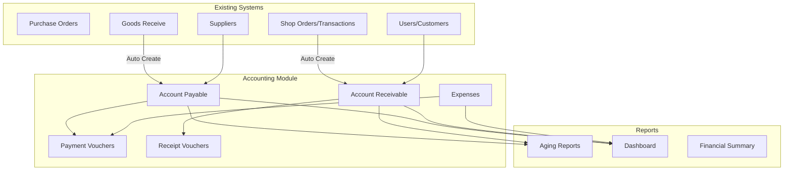

# Design Document: Accounting Management System

## Overview

ระบบจัดการบัญชีรายรับ-รายจ่าย (Accounting Management) สำหรับร้านขายยา/ธุรกิจค้าปลีก ออกแบบให้เชื่อมต่อกับระบบ Procurement (PO/GR) และ Shop Orders ที่มีอยู่ โดยมี 3 โมดูลหลัก:

1. **Account Payable (AP)** - จัดการเจ้าหนี้จาก Supplier
2. **Account Receivable (AR)** - จัดการลูกหนี้จากลูกค้า
3. **Expenses** - จัดการค่าใช้จ่ายดำเนินงาน

## Architecture



## Components and Interfaces

### 1. AccountPayableService

```php
class AccountPayableService {
    // Create AP from GR
    public function createFromGR(int $grId): int;
    
    // Get all AP records with filters
    public function getAll(array $filters = []): array;
    
    // Get single AP with details
    public function getById(int $id): ?array;
    
    // Record payment
    public function recordPayment(int $apId, array $paymentData): int;
    
    // Get aging report
    public function getAgingReport(): array;
    
    // Get upcoming due
    public function getUpcomingDue(int $days = 7): array;
    
    // Get overdue
    public function getOverdue(): array;
}
```

### 2. AccountReceivableService

```php
class AccountReceivableService {
    // Create AR from Transaction
    public function createFromTransaction(int $transactionId): int;
    
    // Get all AR records with filters
    public function getAll(array $filters = []): array;
    
    // Get single AR with details
    public function getById(int $id): ?array;
    
    // Record receipt
    public function recordReceipt(int $arId, array $receiptData): int;
    
    // Get aging report
    public function getAgingReport(): array;
    
    // Get upcoming due
    public function getUpcomingDue(int $days = 7): array;
    
    // Get overdue
    public function getOverdue(): array;
}
```

### 3. ExpenseService

```php
class ExpenseService {
    // Create expense
    public function create(array $data): int;
    
    // Update expense
    public function update(int $id, array $data): bool;
    
    // Delete expense
    public function delete(int $id): bool;
    
    // Get all with filters
    public function getAll(array $filters = []): array;
    
    // Get by category
    public function getByCategory(int $categoryId): array;
    
    // Get monthly summary
    public function getMonthlySummary(string $month): array;
}
```

### 4. ExpenseCategoryService

```php
class ExpenseCategoryService {
    // Create category
    public function create(array $data): int;
    
    // Update category
    public function update(int $id, array $data): bool;
    
    // Get all categories
    public function getAll(): array;
    
    // Initialize default categories
    public function initializeDefaults(): void;
}
```

### 5. PaymentVoucherService

```php
class PaymentVoucherService {
    // Generate voucher number
    public function generateVoucherNumber(): string;
    
    // Create voucher
    public function create(array $data): int;
    
    // Get voucher by ID
    public function getById(int $id): ?array;
    
    // Get payment history
    public function getHistory(array $filters = []): array;
}
```

### 6. ReceiptVoucherService

```php
class ReceiptVoucherService {
    // Generate voucher number
    public function generateVoucherNumber(): string;
    
    // Create voucher
    public function create(array $data): int;
    
    // Get voucher by ID
    public function getById(int $id): ?array;
    
    // Get receipt history
    public function getHistory(array $filters = []): array;
}
```

### 7. AccountingDashboardService

```php
class AccountingDashboardService {
    // Get summary totals
    public function getSummary(): array;
    
    // Get upcoming payments
    public function getUpcomingPayments(int $days = 7): array;
    
    // Get overdue summary
    public function getOverdueSummary(): array;
    
    // Get expense summary by category
    public function getExpenseSummaryByCategory(string $month): array;
}
```

## Data Models

### Database Tables

```sql
-- Account Payable (เจ้าหนี้)
CREATE TABLE IF NOT EXISTS `account_payables` (
    `id` INT AUTO_INCREMENT PRIMARY KEY,
    `line_account_id` INT DEFAULT NULL,
    `ap_number` VARCHAR(50) UNIQUE NOT NULL,
    `supplier_id` INT NOT NULL,
    `po_id` INT DEFAULT NULL,
    `gr_id` INT DEFAULT NULL,
    `invoice_number` VARCHAR(100),
    `invoice_date` DATE,
    `due_date` DATE NOT NULL,
    `total_amount` DECIMAL(12,2) NOT NULL,
    `paid_amount` DECIMAL(12,2) DEFAULT 0,
    `balance` DECIMAL(12,2) NOT NULL,
    `status` ENUM('open', 'partial', 'paid', 'cancelled') DEFAULT 'open',
    `notes` TEXT,
    `metadata` JSON,
    `closed_at` TIMESTAMP NULL,
    `created_at` TIMESTAMP DEFAULT CURRENT_TIMESTAMP,
    `updated_at` TIMESTAMP DEFAULT CURRENT_TIMESTAMP ON UPDATE CURRENT_TIMESTAMP,
    INDEX `idx_ap_supplier` (`supplier_id`),
    INDEX `idx_ap_status` (`status`),
    INDEX `idx_ap_due_date` (`due_date`),
    INDEX `idx_ap_po` (`po_id`),
    INDEX `idx_ap_gr` (`gr_id`)
) ENGINE=InnoDB DEFAULT CHARSET=utf8mb4 COLLATE=utf8mb4_unicode_ci;

-- Account Receivable (ลูกหนี้)
CREATE TABLE IF NOT EXISTS `account_receivables` (
    `id` INT AUTO_INCREMENT PRIMARY KEY,
    `line_account_id` INT DEFAULT NULL,
    `ar_number` VARCHAR(50) UNIQUE NOT NULL,
    `user_id` INT NOT NULL,
    `transaction_id` INT DEFAULT NULL,
    `invoice_number` VARCHAR(100),
    `invoice_date` DATE,
    `due_date` DATE NOT NULL,
    `total_amount` DECIMAL(12,2) NOT NULL,
    `received_amount` DECIMAL(12,2) DEFAULT 0,
    `balance` DECIMAL(12,2) NOT NULL,
    `status` ENUM('open', 'partial', 'paid', 'cancelled') DEFAULT 'open',
    `notes` TEXT,
    `metadata` JSON,
    `closed_at` TIMESTAMP NULL,
    `created_at` TIMESTAMP DEFAULT CURRENT_TIMESTAMP,
    `updated_at` TIMESTAMP DEFAULT CURRENT_TIMESTAMP ON UPDATE CURRENT_TIMESTAMP,
    INDEX `idx_ar_user` (`user_id`),
    INDEX `idx_ar_status` (`status`),
    INDEX `idx_ar_due_date` (`due_date`),
    INDEX `idx_ar_transaction` (`transaction_id`)
) ENGINE=InnoDB DEFAULT CHARSET=utf8mb4 COLLATE=utf8mb4_unicode_ci;

-- Expense Categories (หมวดหมู่ค่าใช้จ่าย)
CREATE TABLE IF NOT EXISTS `expense_categories` (
    `id` INT AUTO_INCREMENT PRIMARY KEY,
    `line_account_id` INT DEFAULT NULL,
    `name` VARCHAR(100) NOT NULL,
    `name_en` VARCHAR(100),
    `description` TEXT,
    `expense_type` ENUM('operating', 'administrative', 'financial', 'other') DEFAULT 'operating',
    `is_default` TINYINT(1) DEFAULT 0,
    `is_active` TINYINT(1) DEFAULT 1,
    `created_at` TIMESTAMP DEFAULT CURRENT_TIMESTAMP,
    INDEX `idx_exp_cat_active` (`is_active`)
) ENGINE=InnoDB DEFAULT CHARSET=utf8mb4 COLLATE=utf8mb4_unicode_ci;

-- Expenses (ค่าใช้จ่าย)
CREATE TABLE IF NOT EXISTS `expenses` (
    `id` INT AUTO_INCREMENT PRIMARY KEY,
    `line_account_id` INT DEFAULT NULL,
    `expense_number` VARCHAR(50) UNIQUE NOT NULL,
    `category_id` INT NOT NULL,
    `amount` DECIMAL(12,2) NOT NULL,
    `expense_date` DATE NOT NULL,
    `due_date` DATE,
    `description` TEXT,
    `vendor_name` VARCHAR(255),
    `reference_number` VARCHAR(100),
    `attachment_path` VARCHAR(500),
    `payment_status` ENUM('unpaid', 'paid') DEFAULT 'unpaid',
    `payment_voucher_id` INT,
    `notes` TEXT,
    `metadata` JSON,
    `created_by` INT,
    `created_at` TIMESTAMP DEFAULT CURRENT_TIMESTAMP,
    `updated_at` TIMESTAMP DEFAULT CURRENT_TIMESTAMP ON UPDATE CURRENT_TIMESTAMP,
    INDEX `idx_exp_category` (`category_id`),
    INDEX `idx_exp_date` (`expense_date`),
    INDEX `idx_exp_status` (`payment_status`)
) ENGINE=InnoDB DEFAULT CHARSET=utf8mb4 COLLATE=utf8mb4_unicode_ci;

-- Payment Vouchers (ใบสำคัญจ่าย)
CREATE TABLE IF NOT EXISTS `payment_vouchers` (
    `id` INT AUTO_INCREMENT PRIMARY KEY,
    `line_account_id` INT DEFAULT NULL,
    `voucher_number` VARCHAR(50) UNIQUE NOT NULL,
    `voucher_type` ENUM('ap', 'expense') NOT NULL,
    `reference_id` INT NOT NULL COMMENT 'AP ID or Expense ID',
    `payment_date` DATE NOT NULL,
    `amount` DECIMAL(12,2) NOT NULL,
    `payment_method` ENUM('cash', 'transfer', 'cheque', 'credit_card') NOT NULL,
    `bank_account` VARCHAR(100),
    `reference_number` VARCHAR(100),
    `cheque_number` VARCHAR(50),
    `cheque_date` DATE,
    `attachment_path` VARCHAR(500),
    `notes` TEXT,
    `metadata` JSON,
    `created_by` INT,
    `created_at` TIMESTAMP DEFAULT CURRENT_TIMESTAMP,
    INDEX `idx_pv_type` (`voucher_type`),
    INDEX `idx_pv_ref` (`reference_id`),
    INDEX `idx_pv_date` (`payment_date`)
) ENGINE=InnoDB DEFAULT CHARSET=utf8mb4 COLLATE=utf8mb4_unicode_ci;

-- Receipt Vouchers (ใบสำคัญรับ)
CREATE TABLE IF NOT EXISTS `receipt_vouchers` (
    `id` INT AUTO_INCREMENT PRIMARY KEY,
    `line_account_id` INT DEFAULT NULL,
    `voucher_number` VARCHAR(50) UNIQUE NOT NULL,
    `ar_id` INT NOT NULL,
    `receipt_date` DATE NOT NULL,
    `amount` DECIMAL(12,2) NOT NULL,
    `payment_method` ENUM('cash', 'transfer', 'cheque', 'credit_card') NOT NULL,
    `bank_account` VARCHAR(100),
    `reference_number` VARCHAR(100),
    `slip_id` INT COMMENT 'Link to payment_slips table',
    `attachment_path` VARCHAR(500),
    `notes` TEXT,
    `metadata` JSON,
    `created_by` INT,
    `created_at` TIMESTAMP DEFAULT CURRENT_TIMESTAMP,
    INDEX `idx_rv_ar` (`ar_id`),
    INDEX `idx_rv_date` (`receipt_date`)
) ENGINE=InnoDB DEFAULT CHARSET=utf8mb4 COLLATE=utf8mb4_unicode_ci;
```

### Default Expense Categories

```php
$defaultCategories = [
    ['name' => 'ค่าสาธารณูปโภค', 'name_en' => 'Utilities', 'expense_type' => 'operating'],
    ['name' => 'ค่าเช่า', 'name_en' => 'Rent', 'expense_type' => 'operating'],
    ['name' => 'เงินเดือน', 'name_en' => 'Salary', 'expense_type' => 'operating'],
    ['name' => 'ค่าอินเทอร์เน็ต', 'name_en' => 'Internet', 'expense_type' => 'operating'],
    ['name' => 'ค่าโทรศัพท์', 'name_en' => 'Telephone', 'expense_type' => 'operating'],
    ['name' => 'ค่าขนส่ง', 'name_en' => 'Transportation', 'expense_type' => 'operating'],
    ['name' => 'ค่าซ่อมบำรุง', 'name_en' => 'Maintenance', 'expense_type' => 'operating'],
    ['name' => 'ค่าใช้จ่ายสำนักงาน', 'name_en' => 'Office Supplies', 'expense_type' => 'administrative'],
    ['name' => 'ค่าธรรมเนียมธนาคาร', 'name_en' => 'Bank Fees', 'expense_type' => 'financial'],
    ['name' => 'อื่นๆ', 'name_en' => 'Miscellaneous', 'expense_type' => 'other'],
];
```

## Correctness Properties

*A property is a characteristic or behavior that should hold true across all valid executions of a system-essentially, a formal statement about what the system should do. Properties serve as the bridge between human-readable specifications and machine-verifiable correctness guarantees.*

### Property 1: AP Creation from GR
*For any* completed Goods Receive (GR) record with a valid PO, creating an AP record should result in:
- AP amount equals GR total amount
- AP due date equals GR date plus supplier credit terms
- AP is linked to both PO and GR
- AP status is 'open' with balance equal to total amount
**Validates: Requirements 1.1, 8.1**

### Property 2: AR Creation from Transaction
*For any* transaction with payment_status not 'paid', creating an AR record should result in:
- AR amount equals transaction grand_total
- AR is linked to the transaction
- AR status is 'open' with balance equal to total amount
**Validates: Requirements 2.1, 8.2**

### Property 3: AP Payment Processing
*For any* AP record and valid payment amount:
- If payment < balance: status becomes 'partial', balance = original_balance - payment, paid_amount increases
- If payment = balance: status becomes 'paid', balance = 0, closed_at is set
- Payment voucher is created with correct voucher number format (PV-YYYYMMDD-XXXX)
- Payment history is maintained
**Validates: Requirements 1.3, 1.4, 1.5, 4.2**

### Property 4: AR Receipt Processing
*For any* AR record and valid receipt amount:
- If receipt < balance: status becomes 'partial', balance = original_balance - receipt, received_amount increases
- If receipt = balance: status becomes 'paid', balance = 0, closed_at is set
- Receipt voucher is created with correct voucher number format (RV-YYYYMMDD-XXXX)
- Receipt history is maintained
**Validates: Requirements 2.3, 2.4, 2.5, 4.2**

### Property 5: Aging Report Grouping
*For any* set of AP or AR records, the aging report should:
- Correctly categorize each record into age brackets (current, 1-30, 31-60, 61-90, 90+)
- Sum of all bracket totals equals grand total
- Each record appears in exactly one bracket
**Validates: Requirements 5.1, 5.2, 5.3**

### Property 6: Dashboard Totals Consistency
*For any* set of AP and AR records:
- Total AP equals sum of all open/partial AP balances
- Total AR equals sum of all open/partial AR balances
- Net position equals Total AR minus Total AP
**Validates: Requirements 6.1**

### Property 7: Expense Creation and Storage
*For any* valid expense data with category, amount, date, and description:
- Expense record is created with all required fields
- Expense number is generated in correct format
- Category reference is valid
**Validates: Requirements 3.1, 3.3**

### Property 8: Payment Metadata Round-Trip
*For any* payment metadata object, serializing to JSON and deserializing back should produce an equivalent object
**Validates: Requirements 7.1, 7.2**

### Property 9: Record Linking Integrity
*For any* AP record with PO/GR links or AR record with transaction link:
- The linked records exist and are accessible
- The link references are bidirectional (can navigate both ways)
**Validates: Requirements 8.3, 8.4**

### Property 10: Voucher Number Uniqueness
*For any* two vouchers created, their voucher numbers should be unique and follow the format:
- Payment Voucher: PV-YYYYMMDD-XXXX
- Receipt Voucher: RV-YYYYMMDD-XXXX
**Validates: Requirements 4.2**

## Error Handling

### Validation Errors
- Invalid payment amount (negative or exceeds balance)
- Missing required fields (supplier_id, user_id, amount, date)
- Invalid date formats
- Non-existent reference IDs (PO, GR, Transaction)

### Business Logic Errors
- Attempting to pay closed AP/AR
- Duplicate voucher numbers
- Invalid expense category
- File upload failures for attachments

### Database Errors
- Foreign key constraint violations
- Unique constraint violations
- Connection failures

### Error Response Format
```php
[
    'success' => false,
    'error' => [
        'code' => 'VALIDATION_ERROR',
        'message' => 'Human readable message',
        'field' => 'field_name' // optional
    ]
]
```

## Testing Strategy

### Unit Testing
- Test individual service methods
- Test voucher number generation
- Test aging bracket calculation
- Test balance calculations

### Property-Based Testing
Using PHPUnit with data providers for property-based testing:

**Library**: PHPUnit with custom generators

**Configuration**: Minimum 100 iterations per property test

**Test File Naming**: `*PropertyTest.php`

**Test Annotation Format**:
```php
/**
 * **Feature: accounting-management, Property {number}: {property_text}**
 * @dataProvider {generatorMethod}
 */
```

### Integration Testing
- Test AP creation from GR completion
- Test AR creation from transaction
- Test payment flow end-to-end
- Test dashboard data aggregation

### Test Coverage Requirements
- All service methods must have unit tests
- All correctness properties must have property-based tests
- Critical paths must have integration tests
