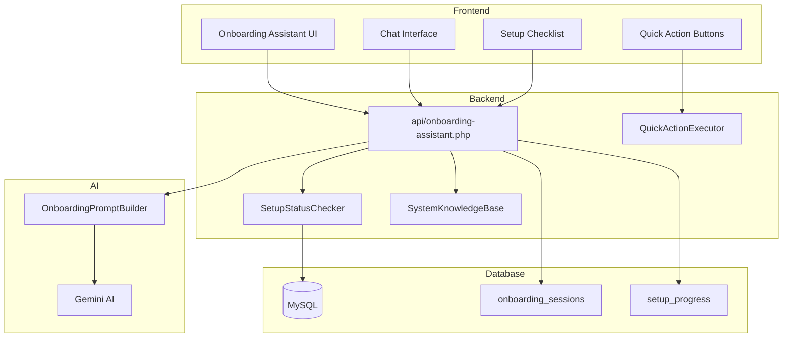

# Design Document: AI Onboarding Assistant

## Overview

AI Onboarding Assistant เป็นระบบผู้ช่วย AI แบบ conversational ที่ช่วยนำทางผู้ใช้ SaaS ใหม่ให้ตั้งค่าและใช้งานระบบ LINE CRM ได้อย่างเต็มประสิทธิภาพ ระบบใช้ Gemini AI เป็น backend พร้อมด้วย knowledge base เกี่ยวกับระบบ และสามารถตรวจสอบสถานะการตั้งค่าแบบ real-time

### Key Features
- **Smart Status Detection**: ตรวจสอบสถานะการตั้งค่าอัตโนมัติ
- **Guided Setup**: แนะนำการตั้งค่าแบบ step-by-step
- **Feature Discovery**: แนะนำฟีเจอร์ตามประเภทธุรกิจ
- **Quick Actions**: ปุ่มลัดไปยังหน้าต่างๆ
- **Health Check**: ตรวจสอบสถานะระบบ
- **Context Awareness**: จำ context และให้ความช่วยเหลือตามหน้าที่อยู่

## Architecture



## Components and Interfaces

### 1. OnboardingAssistant Class

```php
class OnboardingAssistant {
    private $db;
    private $geminiAI;
    private $statusChecker;
    private $knowledgeBase;
    private $lineAccountId;
    private $adminUserId;
    
    public function __construct($db, $lineAccountId, $adminUserId);
    
    // Main chat interface
    public function chat(string $message, array $context = []): array;
    
    // Get current setup status
    public function getSetupStatus(): array;
    
    // Get setup checklist with progress
    public function getChecklist(): array;
    
    // Execute quick action
    public function executeAction(string $action, array $params = []): array;
    
    // Health check
    public function runHealthCheck(): array;
    
    // Get contextual suggestions
    public function getSuggestions(string $currentPage = null): array;
}
```

### 2. SetupStatusChecker Class

```php
class SetupStatusChecker {
    private $db;
    private $lineAccountId;
    
    // Check all setup items
    public function checkAll(): array;
    
    // Individual checks
    public function checkLineConnection(): array;
    public function checkWebhook(): array;
    public function checkLiffSetup(): array;
    public function checkShopSetup(): array;
    public function checkPaymentSetup(): array;
    public function checkShippingSetup(): array;
    public function checkProductsSetup(): array;
    public function checkRichMenuSetup(): array;
    public function checkAutoReplySetup(): array;
    public function checkAISetup(): array;
    
    // Get completion percentage
    public function getCompletionPercentage(): int;
    
    // Get next recommended action
    public function getNextRecommendedAction(): array;
}
```

### 3. SystemKnowledgeBase Class

```php
class SystemKnowledgeBase {
    // Get knowledge about a topic
    public function getKnowledge(string $topic): string;
    
    // Get feature information
    public function getFeatureInfo(string $feature): array;
    
    // Get navigation path
    public function getNavigationPath(string $destination): string;
    
    // Get tips for business type
    public function getTipsForBusinessType(string $businessType): array;
    
    // Get troubleshooting guide
    public function getTroubleshootingGuide(string $issue): array;
}
```

### 4. OnboardingPromptBuilder Class

```php
class OnboardingPromptBuilder {
    // Build system prompt with context
    public function buildSystemPrompt(array $setupStatus, array $context): string;
    
    // Build user prompt with knowledge
    public function buildUserPrompt(string $message, array $relevantKnowledge): string;
    
    // Extract intent from message
    public function extractIntent(string $message): array;
}
```

### 5. QuickActionExecutor Class

```php
class QuickActionExecutor {
    // Available actions
    public function getAvailableActions(): array;
    
    // Execute action
    public function execute(string $action, array $params): array;
    
    // Validate action
    public function validateAction(string $action): bool;
}
```

## Data Models

### onboarding_sessions Table

```sql
CREATE TABLE onboarding_sessions (
    id INT AUTO_INCREMENT PRIMARY KEY,
    line_account_id INT NOT NULL,
    admin_user_id INT NOT NULL,
    conversation_history JSON,
    current_topic VARCHAR(100),
    business_type VARCHAR(50),
    setup_progress JSON,
    last_activity TIMESTAMP DEFAULT CURRENT_TIMESTAMP,
    created_at TIMESTAMP DEFAULT CURRENT_TIMESTAMP,
    FOREIGN KEY (line_account_id) REFERENCES line_accounts(id),
    FOREIGN KEY (admin_user_id) REFERENCES admin_users(id)
);
```

### setup_progress Table

```sql
CREATE TABLE setup_progress (
    id INT AUTO_INCREMENT PRIMARY KEY,
    line_account_id INT NOT NULL,
    item_key VARCHAR(50) NOT NULL,
    status ENUM('pending', 'in_progress', 'completed', 'skipped') DEFAULT 'pending',
    completed_at TIMESTAMP NULL,
    notes TEXT,
    created_at TIMESTAMP DEFAULT CURRENT_TIMESTAMP,
    updated_at TIMESTAMP DEFAULT CURRENT_TIMESTAMP ON UPDATE CURRENT_TIMESTAMP,
    UNIQUE KEY unique_progress (line_account_id, item_key),
    FOREIGN KEY (line_account_id) REFERENCES line_accounts(id)
);
```

### Setup Checklist Items

```php
const SETUP_CHECKLIST = [
    'essential' => [
        'line_connection' => [
            'label' => 'เชื่อมต่อ LINE Official Account',
            'description' => 'เชื่อมต่อบัญชี LINE OA เพื่อรับ-ส่งข้อความ',
            'url' => '/line-accounts',
            'checks' => ['channel_access_token', 'channel_secret']
        ],
        'webhook' => [
            'label' => 'ตั้งค่า Webhook',
            'description' => 'ตั้งค่า Webhook URL ใน LINE Console',
            'url' => '/line-accounts',
            'checks' => ['webhook_verified']
        ],
        'shop_info' => [
            'label' => 'ข้อมูลร้านค้า',
            'description' => 'ตั้งค่าชื่อร้าน โลโก้ และข้อมูลติดต่อ',
            'url' => '/shop/liff-shop-settings',
            'checks' => ['shop_name', 'shop_logo']
        ],
        'products' => [
            'label' => 'เพิ่มสินค้า',
            'description' => 'เพิ่มสินค้าอย่างน้อย 1 รายการ',
            'url' => '/shop/products',
            'checks' => ['has_products']
        ]
    ],
    'recommended' => [
        'liff_shop' => [
            'label' => 'ตั้งค่า LIFF Shop',
            'description' => 'เปิดใช้งานร้านค้าใน LINE',
            'url' => '/liff-settings',
            'checks' => ['liff_shop_id']
        ],
        'payment' => [
            'label' => 'ตั้งค่าการชำระเงิน',
            'description' => 'เพิ่มบัญชีธนาคารหรือ PromptPay',
            'url' => '/shop/liff-shop-settings',
            'checks' => ['has_payment_method']
        ],
        'rich_menu' => [
            'label' => 'สร้าง Rich Menu',
            'description' => 'สร้างเมนูลัดสำหรับลูกค้า',
            'url' => '/rich-menu',
            'checks' => ['has_rich_menu']
        ],
        'auto_reply' => [
            'label' => 'ตั้งค่าตอบอัตโนมัติ',
            'description' => 'ตั้งค่าข้อความตอบกลับอัตโนมัติ',
            'url' => '/auto-reply',
            'checks' => ['has_auto_reply']
        ]
    ],
    'advanced' => [
        'ai_chat' => [
            'label' => 'เปิดใช้ AI ตอบแชท',
            'description' => 'ใช้ AI ตอบคำถามลูกค้าอัตโนมัติ',
            'url' => '/ai-chat-settings',
            'checks' => ['ai_enabled', 'gemini_api_key']
        ],
        'broadcast' => [
            'label' => 'ส่ง Broadcast แรก',
            'description' => 'ส่งข้อความถึงลูกค้าทั้งหมด',
            'url' => '/broadcast',
            'checks' => ['has_broadcast']
        ],
        'loyalty' => [
            'label' => 'ตั้งค่าแต้มสะสม',
            'description' => 'เปิดใช้ระบบแต้มสะสมสำหรับลูกค้า',
            'url' => '/loyalty-points',
            'checks' => ['loyalty_enabled']
        ],
        'member_card' => [
            'label' => 'ตั้งค่าบัตรสมาชิก',
            'description' => 'สร้างบัตรสมาชิกดิจิทัล',
            'url' => '/members',
            'checks' => ['liff_member_id']
        ]
    ]
];
```

## Correctness Properties

*A property is a characteristic or behavior that should hold true across all valid executions of a system-essentially, a formal statement about what the system should do. Properties serve as the bridge between human-readable specifications and machine-verifiable correctness guarantees.*

### Property 1: Setup Status Detection Accuracy
*For any* configuration state, the SetupStatusChecker SHALL correctly identify all completed and pending items matching the actual database state.
**Validates: Requirements 1.2, 1.3**

### Property 2: LINE Credential Validation
*For any* LINE credentials provided, the system SHALL correctly validate them against LINE API and return accurate success/failure status.
**Validates: Requirements 2.3, 2.4**

### Property 3: LIFF ID Format Validation
*For any* LIFF ID input, the system SHALL correctly validate the format (pattern: numbers followed by dash and alphanumeric) and accept only valid formats.
**Validates: Requirements 4.3**

### Property 4: Feature Information Completeness
*For any* feature query, the AI response SHALL contain the feature name, description, and a valid navigation URL.
**Validates: Requirements 5.2, 5.3**

### Property 5: Business Type Recommendation Relevance
*For any* business type (pharmacy, retail, service, restaurant), the recommendations SHALL include features relevant to that business type.
**Validates: Requirements 5.4, 8.4**

### Property 6: Health Check Coverage
*For any* health check request, the system SHALL verify all critical components (LINE API, database, LIFF) and report status for each.
**Validates: Requirements 7.2, 7.3**

### Property 7: Context Persistence
*For any* user session, returning to the assistant SHALL recall the previous setup progress and conversation context.
**Validates: Requirements 8.1, 8.3**

### Property 8: Quick Action Execution
*For any* quick action button click, the system SHALL either navigate to the correct page or execute the action and return a result.
**Validates: Requirements 9.2, 9.3**

### Property 9: Checklist Progress Calculation
*For any* set of completed checklist items, the progress percentage SHALL equal (completed items / total items) * 100.
**Validates: Requirements 10.1, 10.4**

### Property 10: Checklist Category Structure
*For any* checklist view, the items SHALL be organized into categories (essential, recommended, advanced) with correct sub-items.
**Validates: Requirements 10.2**

## Error Handling

### API Errors
- Gemini API failures: Return cached/fallback responses
- LINE API failures: Report specific error and suggest manual verification
- Database errors: Log error and return user-friendly message

### Validation Errors
- Invalid LIFF ID format: Show format example and retry option
- Invalid LINE credentials: Explain common mistakes and provide retry
- Missing required fields: Highlight missing fields with guidance

### Rate Limiting
- Gemini API: Implement request queuing and caching
- LINE API: Cache validation results for 5 minutes

## Testing Strategy

### Unit Testing
- Test SetupStatusChecker for each configuration type
- Test LIFF ID validation with valid/invalid formats
- Test knowledge base retrieval for all topics
- Test prompt builder output format

### Property-Based Testing (fast-check)
- Property 1: Generate random configuration states, verify detection accuracy
- Property 2: Generate valid/invalid LINE credentials, verify validation
- Property 3: Generate LIFF ID strings, verify format validation
- Property 6: Generate health check scenarios, verify coverage
- Property 9: Generate completed item sets, verify percentage calculation

### Integration Testing
- Test full chat flow with Gemini AI
- Test quick action execution
- Test session persistence across requests

### E2E Testing
- Test complete onboarding flow from start to finish
- Test checklist interaction and progress updates
