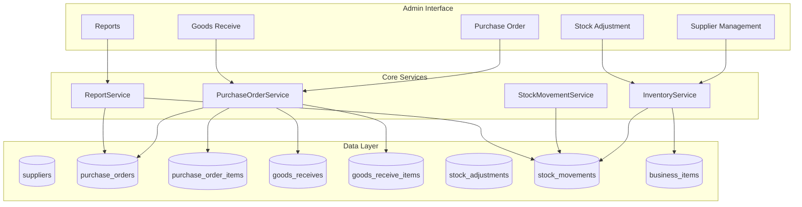

# Design Document: Inventory Management System

## Overview

ระบบ Inventory Management สำหรับจัดการคลังสินค้าแบบครบวงจร ออกแบบให้ทำงานร่วมกับระบบ Shop ที่มีอยู่ โดยเพิ่มความสามารถในการจัดการ Purchase Order, Goods Receive, Stock Adjustment และ Stock Movement Tracking

### Key Design Decisions

1. **Integrate with existing business_items table** - ใช้ตาราง business_items ที่มีอยู่ (มี cost_price, min_stock อยู่แล้ว) เพิ่ม column reorder_point
2. **Document-based workflow** - ใช้ระบบเอกสาร (PO, GR, ADJ) เป็นหลักในการเคลื่อนไหวสต็อก
3. **Audit trail** - บันทึกทุกการเคลื่อนไหวของสต็อกใน stock_movements table
4. **Multi-bot support** - รองรับ line_account_id สำหรับแยกข้อมูลแต่ละบัญชี

## Architecture



## Components and Interfaces

### 1. InventoryService

จัดการ stock adjustment และ stock queries

```php
interface InventoryServiceInterface {
    // Stock Adjustment
    public function createAdjustment(array $data): StockAdjustment;
    public function confirmAdjustment(int $adjustmentId): bool;
    
    // Stock Queries
    public function getProductStock(int $productId): int;
    public function getLowStockProducts(): array;
    public function getStockMovements(int $productId, array $filters): array;
    
    // Stock Update (internal)
    public function updateStock(int $productId, int $quantity, string $type, string $reference): bool;
}
```

### 2. PurchaseOrderService

จัดการ Purchase Order และ Goods Receive

```php
interface PurchaseOrderServiceInterface {
    // Purchase Order
    public function createPO(array $data): PurchaseOrder;
    public function addPOItem(int $poId, array $item): PurchaseOrderItem;
    public function submitPO(int $poId): bool;
    public function cancelPO(int $poId, string $reason): bool;
    
    // Goods Receive
    public function createGR(int $poId): GoodsReceive;
    public function receiveItems(int $grId, array $items): bool;
    public function confirmGR(int $grId): bool;
}
```

### 3. SupplierService

จัดการข้อมูล Supplier

```php
interface SupplierServiceInterface {
    public function create(array $data): Supplier;
    public function update(int $id, array $data): bool;
    public function deactivate(int $id): bool;
    public function getAll(array $filters): array;
    public function getById(int $id): ?Supplier;
}
```

### 4. ReportService

สร้างรายงาน Inventory

```php
interface ReportServiceInterface {
    public function getStockValuation(): array;
    public function getPurchaseHistory(array $filters): array;
    public function getStockMovementSummary(array $filters): array;
    public function exportToCSV(string $reportType, array $data): string;
}
```

## Data Models

### suppliers

```sql
CREATE TABLE suppliers (
    id INT AUTO_INCREMENT PRIMARY KEY,
    line_account_id INT DEFAULT NULL,
    code VARCHAR(20) UNIQUE,
    name VARCHAR(255) NOT NULL,
    contact_person VARCHAR(255),
    phone VARCHAR(50),
    email VARCHAR(255),
    address TEXT,
    tax_id VARCHAR(20),
    payment_terms INT DEFAULT 30 COMMENT 'วันครบกำหนดชำระ',
    total_purchase_amount DECIMAL(15,2) DEFAULT 0,
    is_active TINYINT(1) DEFAULT 1,
    created_at TIMESTAMP DEFAULT CURRENT_TIMESTAMP,
    updated_at TIMESTAMP DEFAULT CURRENT_TIMESTAMP ON UPDATE CURRENT_TIMESTAMP,
    INDEX idx_supplier_code (code),
    INDEX idx_supplier_active (is_active)
);
```

### purchase_orders

```sql
CREATE TABLE purchase_orders (
    id INT AUTO_INCREMENT PRIMARY KEY,
    line_account_id INT DEFAULT NULL,
    po_number VARCHAR(30) UNIQUE NOT NULL,
    supplier_id INT NOT NULL,
    status ENUM('draft', 'submitted', 'partial', 'completed', 'cancelled') DEFAULT 'draft',
    order_date DATE NOT NULL,
    expected_date DATE,
    subtotal DECIMAL(15,2) DEFAULT 0,
    tax_amount DECIMAL(15,2) DEFAULT 0,
    total_amount DECIMAL(15,2) DEFAULT 0,
    notes TEXT,
    cancel_reason TEXT,
    created_by INT,
    submitted_at TIMESTAMP NULL,
    cancelled_at TIMESTAMP NULL,
    created_at TIMESTAMP DEFAULT CURRENT_TIMESTAMP,
    updated_at TIMESTAMP DEFAULT CURRENT_TIMESTAMP ON UPDATE CURRENT_TIMESTAMP,
    FOREIGN KEY (supplier_id) REFERENCES suppliers(id),
    INDEX idx_po_number (po_number),
    INDEX idx_po_status (status),
    INDEX idx_po_supplier (supplier_id)
);
```

### purchase_order_items

```sql
CREATE TABLE purchase_order_items (
    id INT AUTO_INCREMENT PRIMARY KEY,
    po_id INT NOT NULL,
    product_id INT NOT NULL COMMENT 'FK to business_items.id',
    quantity INT NOT NULL,
    received_quantity INT DEFAULT 0,
    unit_cost DECIMAL(10,2) NOT NULL,
    subtotal DECIMAL(15,2) NOT NULL,
    notes TEXT,
    FOREIGN KEY (po_id) REFERENCES purchase_orders(id) ON DELETE CASCADE,
    FOREIGN KEY (product_id) REFERENCES business_items(id),
    INDEX idx_poi_po (po_id),
    INDEX idx_poi_product (product_id)
);
```

### goods_receives

```sql
CREATE TABLE goods_receives (
    id INT AUTO_INCREMENT PRIMARY KEY,
    line_account_id INT DEFAULT NULL,
    gr_number VARCHAR(30) UNIQUE NOT NULL,
    po_id INT NOT NULL,
    status ENUM('draft', 'confirmed', 'cancelled') DEFAULT 'draft',
    receive_date DATE NOT NULL,
    notes TEXT,
    received_by INT,
    confirmed_at TIMESTAMP NULL,
    created_at TIMESTAMP DEFAULT CURRENT_TIMESTAMP,
    updated_at TIMESTAMP DEFAULT CURRENT_TIMESTAMP ON UPDATE CURRENT_TIMESTAMP,
    FOREIGN KEY (po_id) REFERENCES purchase_orders(id),
    INDEX idx_gr_number (gr_number),
    INDEX idx_gr_po (po_id)
);
```

### goods_receive_items

```sql
CREATE TABLE goods_receive_items (
    id INT AUTO_INCREMENT PRIMARY KEY,
    gr_id INT NOT NULL,
    po_item_id INT NOT NULL,
    product_id INT NOT NULL COMMENT 'FK to business_items.id',
    quantity INT NOT NULL,
    notes TEXT,
    FOREIGN KEY (gr_id) REFERENCES goods_receives(id) ON DELETE CASCADE,
    FOREIGN KEY (po_item_id) REFERENCES purchase_order_items(id),
    FOREIGN KEY (product_id) REFERENCES business_items(id),
    INDEX idx_gri_gr (gr_id)
);
```

### stock_adjustments

```sql
CREATE TABLE stock_adjustments (
    id INT AUTO_INCREMENT PRIMARY KEY,
    line_account_id INT DEFAULT NULL,
    adjustment_number VARCHAR(30) UNIQUE NOT NULL,
    adjustment_type ENUM('increase', 'decrease') NOT NULL,
    product_id INT NOT NULL COMMENT 'FK to business_items.id',
    quantity INT NOT NULL,
    reason ENUM('physical_count', 'damaged', 'expired', 'lost', 'found', 'correction', 'other') NOT NULL,
    reason_detail TEXT,
    stock_before INT NOT NULL,
    stock_after INT NOT NULL,
    status ENUM('draft', 'confirmed', 'cancelled') DEFAULT 'draft',
    created_by INT,
    confirmed_at TIMESTAMP NULL,
    created_at TIMESTAMP DEFAULT CURRENT_TIMESTAMP,
    FOREIGN KEY (product_id) REFERENCES business_items(id),
    INDEX idx_adj_number (adjustment_number),
    INDEX idx_adj_product (product_id)
);
```

### stock_movements

```sql
CREATE TABLE stock_movements (
    id INT AUTO_INCREMENT PRIMARY KEY,
    line_account_id INT DEFAULT NULL,
    product_id INT NOT NULL COMMENT 'FK to business_items.id',
    movement_type ENUM('receive', 'sale', 'adjustment_in', 'adjustment_out', 'return', 'transfer') NOT NULL,
    quantity INT NOT NULL COMMENT 'บวก=เข้า, ลบ=ออก',
    stock_before INT NOT NULL,
    stock_after INT NOT NULL,
    reference_type VARCHAR(50) COMMENT 'goods_receive, order, adjustment',
    reference_id INT,
    reference_number VARCHAR(50),
    notes TEXT,
    created_by INT,
    created_at TIMESTAMP DEFAULT CURRENT_TIMESTAMP,
    FOREIGN KEY (product_id) REFERENCES business_items(id),
    INDEX idx_sm_product (product_id),
    INDEX idx_sm_type (movement_type),
    INDEX idx_sm_reference (reference_type, reference_id),
    INDEX idx_sm_created (created_at)
);
```

### Business Items Table Updates

```sql
-- business_items มี cost_price และ min_stock อยู่แล้ว
-- เพิ่มเฉพาะ reorder_point และ supplier_id

ALTER TABLE business_items 
ADD COLUMN reorder_point INT DEFAULT 5 AFTER min_stock,
ADD COLUMN supplier_id INT DEFAULT NULL AFTER line_account_id,
ADD INDEX idx_product_supplier (supplier_id),
ADD INDEX idx_product_reorder (reorder_point);
```


## Correctness Properties

*A property is a characteristic or behavior that should hold true across all valid executions of a system-essentially, a formal statement about what the system should do. Properties serve as the bridge between human-readable specifications and machine-verifiable correctness guarantees.*

### Property 1: Document Number Uniqueness and Format
*For any* document type (PO, GR, ADJ), when created, the generated document number SHALL be unique and follow the format "{TYPE}-YYYYMMDD-XXXX"
**Validates: Requirements 2.1, 3.1, 4.1**

### Property 2: Purchase Order Total Calculation
*For any* purchase order with line items, the total_amount SHALL equal the sum of (quantity × unit_cost) for all items
**Validates: Requirements 2.3**

### Property 3: Goods Receive Stock Update
*For any* confirmed goods receive, the product stock_after SHALL equal stock_before plus received_quantity
**Validates: Requirements 3.4**

### Property 4: Partial Receive Tracking
*For any* purchase order item, the remaining_quantity SHALL equal ordered_quantity minus total_received_quantity across all goods receives
**Validates: Requirements 3.3**

### Property 5: Stock Movement Audit Trail
*For any* stock change (receive, sale, adjustment), a stock_movement record SHALL exist with correct movement_type, quantity, and reference
**Validates: Requirements 5.1, 3.6**

### Property 6: Running Balance Consistency
*For any* product, the stock_after of each movement SHALL equal the stock_before of the next movement (when ordered by created_at)
**Validates: Requirements 5.3**

### Property 7: Stock Adjustment Correctness
*For any* confirmed stock adjustment, if type is "increase" then stock_after = stock_before + quantity, if type is "decrease" then stock_after = stock_before - quantity
**Validates: Requirements 4.3**

### Property 8: Low Stock Alert Accuracy
*For any* product where current_stock < reorder_point, the product SHALL appear in low stock alerts list
**Validates: Requirements 6.1**

### Property 9: Stock Valuation Calculation
*For any* stock valuation report, the total_value SHALL equal sum of (product.stock × product.cost_price) for all active products
**Validates: Requirements 7.1**

### Property 10: Serialization Round-Trip
*For any* valid purchase order or stock movement data, serializing to JSON then deserializing SHALL produce equivalent data
**Validates: Requirements 8.5**

### Property 11: Supplier Deactivation Constraint
*For any* deactivated supplier, creating a new purchase order with that supplier SHALL be rejected
**Validates: Requirements 1.4**

### Property 12: PO Completion Status
*For any* purchase order where all items have received_quantity equal to ordered_quantity, the PO status SHALL be "completed"
**Validates: Requirements 3.5**

## Error Handling

### Validation Errors
- Empty PO submission → Return error "Purchase order must have at least one item"
- Negative stock adjustment → Return error "Stock cannot be negative"
- Invalid supplier for PO → Return error "Supplier is inactive or not found"
- Invalid product in PO item → Return error "Product not found"

### Business Logic Errors
- Duplicate document number → Auto-increment sequence number
- GR for cancelled PO → Return error "Cannot receive goods for cancelled PO"
- Adjustment for non-existent product → Return error "Product not found"

### Data Integrity Errors
- Foreign key violations → Return appropriate error message
- JSON parse errors → Return error with line/position information

## Testing Strategy

### Property-Based Testing Library
**Library:** PHPUnit with `eris/eris` for property-based testing in PHP

### Unit Tests
- Test document number generation format
- Test total calculation for PO
- Test stock update logic
- Test status transitions

### Property-Based Tests
Each correctness property will have a corresponding property-based test:

1. **Document Number Property Test** - Generate random documents, verify uniqueness and format
2. **PO Total Property Test** - Generate random PO items, verify total calculation
3. **GR Stock Update Property Test** - Generate random GR confirmations, verify stock changes
4. **Movement Audit Trail Property Test** - Generate random stock operations, verify movement records exist
5. **Running Balance Property Test** - Generate sequence of movements, verify balance consistency
6. **Round-Trip Property Test** - Generate random PO/movement data, serialize/deserialize, compare

### Test Configuration
- Minimum 100 iterations per property test
- Each test tagged with: `**Feature: inventory-management, Property {N}: {property_text}**`

### Integration Tests
- Full PO → GR → Stock update flow
- Stock adjustment with movement tracking
- Low stock alert generation
- Report generation with real data

