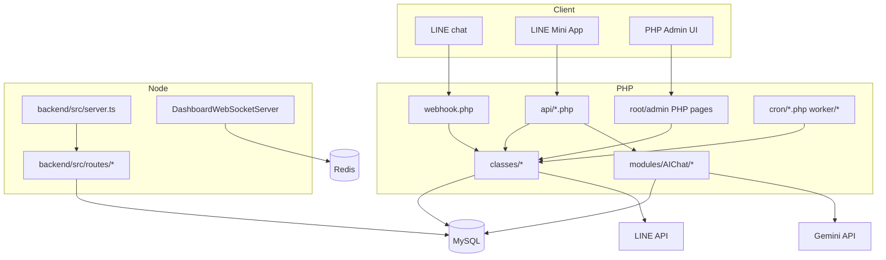
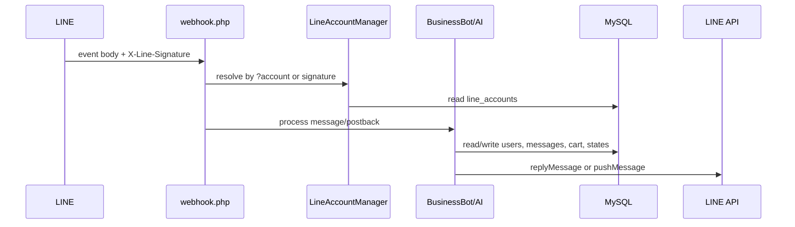
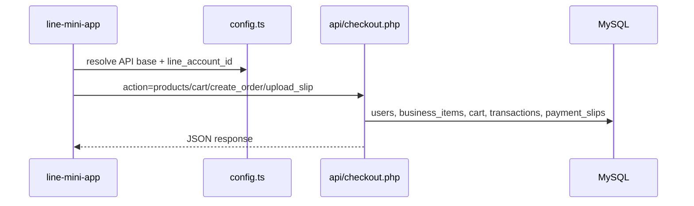

# Architecture

## Style and Layers

Confirmed style: hybrid PHP monolith plus shared LINE Mini App plus modern Fastify service. The PHP monolith is the main system of record for LINE, shop, inbox, admin pages, APIs, database writes, and cron. The mini app is a Next.js 15 client that calls PHP endpoints using runtime tenant context. The Fastify backend registers JWT-protected API groups and WebSocket services using Prisma/Redis.

Major layers:

- Presentation: PHP admin pages such as `inbox-v2.php`, root `*.php` pages, and `line-mini-app/src/app/*`.
- PHP API layer: `api/*.php`, using action switches and JSON/SSE/multipart contracts.
- Service layer: `classes/*`, `modules/AIChat/*`, `app/*`.
- Data layer: `config/database.php`, `classes/Database.php`, `modules/Core/Database.php`, MySQL schema files.
- Integration layer: `classes/LineAPI.php`, Gemini adapters, OAuth/SSO, Redis, email/Slack/LINE notifications.
- Jobs: `cron/*.php`, `worker/notification-worker.php`.

## Entry Points

- `webhook.php?account={id}`: LINE webhook entry point with signature validation and account resolution.
- `auth/login.php`: tenant admin login.
- `admin/platform-login.php`: platform user login.
- `inbox-v2.php`: active CRM inbox and same-page AJAX handler.
- `api/checkout.php`: mini app shop/cart/order/payment endpoint.
- `api/ai-chat.php`: SSE AI chat endpoint.
- `backend/src/server.ts`: Fastify server and WebSocket setup.
- `cron/*.php`: scheduled job scripts.

## Component Diagram

## Key Sequence: LINE Message

## Key Sequence: Mini App Checkout

## Inferred Facts

The repo is in a transition toward tenant-aware database routing. Evidence: `modules/Core/Database.php` supports `forTenant()` and `platform()`, while `classes/Database.php` warns that `config/database.php` may still win depending on load order.

## Last Verified From Code

Verified on 2026-07-03 from `webhook.php`, `classes/LineAccountManager.php`, `classes/BusinessBot.php`, `classes/LineAPI.php`, `line-mini-app/src/lib/config.ts`, `line-mini-app/src/lib/shop-api.ts`, `api/checkout.php`, `backend/src/server.ts`, `backend/src/routes/index.ts`, `modules/Core/Database.php`, `classes/Database.php`.
