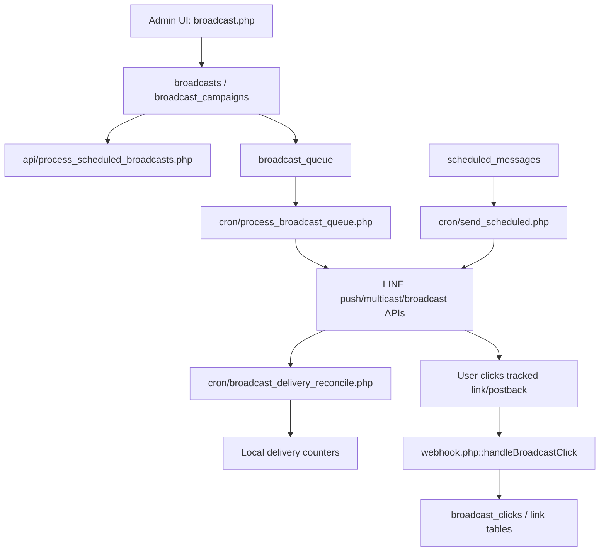

# Broadcast and Quota

## Scope

This document explains broadcast sending paths, scheduled delivery, quota-aware LINE API usage, delivery reconciliation, and quota-related risks.

## Confirmed Broadcast Surfaces

| Surface | Responsibility | Evidence |
| --- | --- | --- |
| Admin broadcast UI | Main admin entry point that includes catalog, product, stats, and send submodules | `broadcast.php`, `includes/broadcast/catalog.php`, `includes/broadcast/products.php`, `includes/broadcast/stats.php`, `includes/broadcast/send.php` |
| Scheduled broadcast API | Processes scheduled rows in `broadcasts` whose `scheduled_at <= NOW()` | `api/process_scheduled_broadcasts.php` |
| Queue worker | Sends pending rows from `broadcast_queue` and updates send/failed state | `cron/process_broadcast_queue.php` |
| Scheduled messages | Sends rows from `scheduled_messages` with target types and content sources | `cron/send_scheduled.php` |
| Delivery reconciliation | Reconciles local counters against LINE delivery/progress APIs | `cron/broadcast_delivery_reconcile.php` |
| LINE API wrapper | Implements broadcast, narrowcast, multicast/push helpers, and quota endpoints | `classes/LineAPI.php` |

## Data Model

Confirmed tables and fields:

- `database/migration_2026-05-04_unified_broadcast.sql` extends `broadcast_campaigns` with delivery counters such as `delivered_count`, `failed_count`, and unique clicker counters.
- `database/migration_2026-05-04_unified_broadcast.sql` adds targeting fields such as `target_type` and `target_payload`.
- `database/migration_2026-05-04_unified_broadcast.sql` adds `broadcast_links`, `broadcast_link_clicks`, and `broadcast_drafts`.
- `cron/process_broadcast_queue.php` reads `broadcast_queue` joined with `broadcasts` and `users`.
- `webhook.php::handleBroadcastClick()` records click activity in `broadcast_clicks`.

## Sending Paths

## Quota Behavior

Confirmed facts:

- `classes/LineAPI.php` exposes LINE quota-related helpers: `getMessageQuota()`, `getMessageQuotaConsumption()`, and `getNumberOfSentMessages()`.
- `classes/LineAPI.php` exposes `getNarrowcastProgress()` for narrowcast delivery progress.
- `classes/LineAPI.php` sets `upToRemainingQuota => true` in the narrowcast request path, which asks LINE to send only within remaining quota.
- `cron/process_broadcast_queue.php` uses `RateLimiter('broadcast_'.$accountId, 60, 60)`, indicating a local rate limit of 60 sends per 60 seconds per account.
- `cron/process_broadcast_queue.php` tries grouped/multicast sending and falls back to individual `pushMessage()` when needed.
- `LineAPI::sendMessage()` attempts reply-message delivery before push fallback, but broadcast jobs generally use push/multicast/broadcast paths because they are not responding to a live reply token.

## Delivery Counters

Confirmed facts:

- `cron/process_broadcast_queue.php` updates queue rows to sent/failed and increments broadcast sent counts.
- `cron/broadcast_delivery_reconcile.php` reconciles local counters through two paths: narrowcast progress by `narrowcast_request_id`, and aggregate sent-message counts for push/multicast/broadcast.
- Because LINE aggregate delivery metrics are not always campaign-specific, proportional attribution is used for some reconciliation cases.

## Failure Modes

| Failure | Evidence | Operational impact |
| --- | --- | --- |
| LINE quota exhausted | Quota helpers in `classes/LineAPI.php`; `upToRemainingQuota` for narrowcast | Broadcast may partially send or stop before all recipients are reached |
| Individual push fallback increases request count | `cron/process_broadcast_queue.php` fallback to `pushMessage()` | Higher risk of rate/quota pressure |
| Queue rows fail | `cron/process_broadcast_queue.php` updates failed state | Campaign counters can diverge until reconciliation |
| Reconciliation is approximate for aggregate APIs | `cron/broadcast_delivery_reconcile.php` proportional attribution | Delivery metrics may be directionally useful but not exact for all campaign types |
| Webhook click tracking failure | `webhook.php::handleBroadcastClick()` catches/logs errors | Click metrics and tag assignment may be incomplete |

## Recommended Operating Checks

- Before large sends, use `LineAPI::getMessageQuota()` and `LineAPI::getMessageQuotaConsumption()` to estimate remaining quota.
- Prefer narrowcast when recipient criteria are expressible through LINE targeting and quota safety is important, because the code uses `upToRemainingQuota`.
- Watch `broadcast_queue` failed rows after `cron/process_broadcast_queue.php` runs.
- Run or inspect `cron/broadcast_delivery_reconcile.php` before reporting final delivery numbers.
- For click-related incidents, check `broadcast_clicks`, `broadcast_link_clicks`, and `webhook.php` logs.

## Unknowns

- Exact production cron schedule is not confirmed in code, though comments indicate queue/scheduled workers are intended to run every minute and delivery reconciliation every 5 minutes.
- Exact LINE plan quota is external to the repository and must be checked in LINE Official Account Manager or through LINE quota APIs.
- No single code-backed source was found that enforces a global campaign approval workflow before broadcast.

## Last Verified From Code

- Verified from `broadcast.php`, `includes/broadcast/*.php`, `api/process_scheduled_broadcasts.php`, `cron/process_broadcast_queue.php`, `cron/send_scheduled.php`, `cron/broadcast_delivery_reconcile.php`, `classes/LineAPI.php`, `webhook.php`, and `database/migration_2026-05-04_unified_broadcast.sql` on 2026-07-03.

