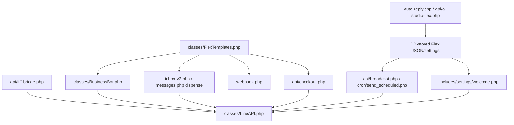

# Flex Template System

## Scope

This document maps where LINE Flex messages are built, stored, generated, and sent.

## Confirmed Flex Producers

| Producer | Responsibility | Evidence |
| --- | --- | --- |
| `classes/FlexTemplates.php` | Central reusable Flex template class and LINE message wrapper | `FlexTemplates::toMessage()`, medicine-label methods, notification helpers |
| `classes/BusinessBot.php` | Customer-facing bot menus, points, rewards, member card, cart/order responses | Calls `FlexTemplates::toMessage()` and sends Flex replies |
| `webhook.php` | Webhook command routing and receipt-points Flex cards | `buildReceiptPointsFlex()`, `persistReceiptConversationCard()` |
| `inbox-v2.php` and `messages.php` | Dispense flow sends medicine-label Flex messages | Existing docs and `FlexTemplates::medicineLabel()` usage |
| `api/checkout.php` | Checkout/order receipt Flex messages | `buildFlexReceipt()` and LINE send logic |
| `auto-reply.php` | Admin auto-reply supports Flex Message JSON and Flex Builder workflows | File-level references to Flex Message JSON |
| `api/broadcast.php` | Broadcast API validates/wraps Flex message payloads | Sends Flex Message Broadcast |
| `api/ai-studio-flex.php` | AI-assisted Flex generation/edit/copy endpoint | Type inputs include product, promo, menu, receipt, welcome, announce, booking, custom |
| `api/liff-bridge.php` | Creates Flex messages for LIFF events | Order, appointment, consult, points, and health-profile flows |
| Cron reminder jobs | Generate reminder and notification Flex cards | `cron/medication_reminder.php`, `cron/appointment_reminder.php`, `cron/reward_expiry_reminder.php`, `cron/restock_notification.php`, `cron/wishlist_notification.php` |

## Architecture

## Message Wrapping Contract

Confirmed facts:

- `FlexTemplates::toMessage()` converts a Flex bubble/carousel into the LINE message envelope with `type = flex`.
- `api/broadcast.php` validates Flex payload shape and wraps bubble/carousel content as a LINE Flex message before sending.
- `cron/send_scheduled.php` supports multiple content sources including `custom`, `template`, `product`, and `flex`; it wraps bubble/carousel JSON as Flex when needed.
- Product carousel generation in scheduled messages is capped to LINE carousel limits by building up to 10 bubbles.

## Business Domains Using Flex

| Domain | Flex use |
| --- | --- |
| Welcome/onboarding | Welcome settings and webhook follow responses can use rich Flex content |
| Commerce | Product cards, cart/order summaries, checkout receipts, and scheduled product broadcasts |
| Loyalty | Points, rewards, member card, redemption responses |
| Pharmacy operations | Medicine-label Flex messages in dispense flows |
| Reminders | Medication, refill, appointment, reward expiry, restock, wishlist notifications |
| AI-assisted creation | AI Studio Flex generation and editing |

## Confirmed Safety Constraints

- Flex payloads are JSON objects and must preserve LINE's required `type` structure. Broken JSON causes send failures.
- Broadcast Flex sends can consume push/broadcast quota because they are not reply-token responses.
- The same Flex payload may be rendered in multiple surfaces, so template changes in `classes/FlexTemplates.php` can affect webhook replies, dispense flow, checkout receipts, and reminders.
- Some Flex JSON is editable through admin settings; validation must happen before send, not only at save time.

## Unknowns

- A single global Flex schema validator was not found. Validation appears distributed across sending surfaces.
- Exact DB columns for every stored Flex payload vary by feature and are not fully normalized in one table.
- Runtime LINE rendering behavior must still be verified against LINE clients, because code validation cannot prove visual fit.

## Last Verified From Code

- Verified from `classes/FlexTemplates.php`, `classes/BusinessBot.php`, `webhook.php`, `api/checkout.php`, `api/broadcast.php`, `api/ai-studio-flex.php`, `api/liff-bridge.php`, `auto-reply.php`, `includes/settings/welcome.php`, `cron/send_scheduled.php`, and reminder cron files on 2026-07-03.

