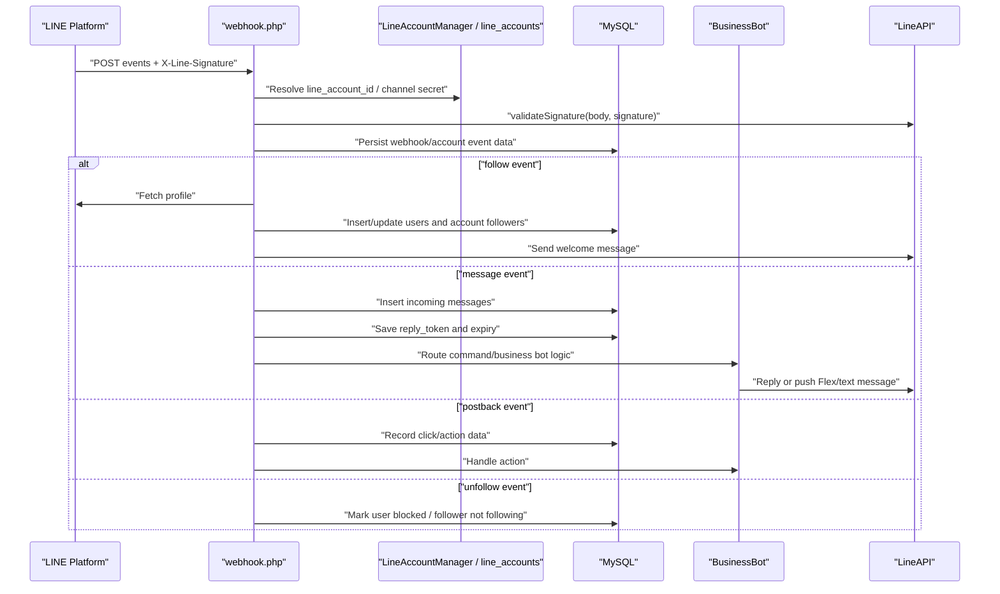

# LINE Webhook Flow

## Scope

This document explains the inbound LINE Messaging API webhook path. It covers account resolution, signature validation, event dispatch, message persistence, bot replies, and operational failure points.

## Confirmed Facts

- The main LINE webhook entry point is `webhook.php`; the project-level entry-point table also lists `webhook.php?account={id}` as the multi-account LINE webhook.
- Tenant/account selection is request-scoped. `webhook.php` reads account information before handling events, and `classes/LineAccountManager.php` is the account-management surface referenced by the webhook.
- LINE signature validation is implemented through `LineAPI::validateSignature()` in `classes/LineAPI.php`.
- `webhook.php` dispatches LINE event types including `follow`, `unfollow`, `message`, and `postback`.
- `webhook.php` saves inbound messages into the `messages` table with `direction = 'incoming'`, message type/content, and the LINE `reply_token` when present.
- `webhook.php` stores reply tokens back on `users.reply_token` with `users.reply_token_expires`; comments state the expiry is set to roughly 50 seconds because LINE reply tokens expire in about 1 minute.
- `LineAPI::sendMessage()` in `classes/LineAPI.php` is the preferred outbound helper because it attempts reply-token delivery first and can fall back to push delivery.
- `webhook.php` has a shutdown handler that writes fatal errors to `dev_logs` with source `webhook_fatal`.
- `webhook.php` logs webhook exceptions and operational errors to `error_log` and, where possible, `dev_logs`.

## Event Flow

## Follow Event

Confirmed behavior:

- `handleFollow()` in `webhook.php` calls `$line->getProfile($userId)` and captures `displayName`, `pictureUrl`, and `statusMessage`.
- The user is inserted into or resolved from `users` using `line_user_id`, with `line_account_id` when available.
- `saveAccountFollower()` records LINE-account follower data including `line_account_id`, `line_user_id`, `user_id`, profile fields, following status, and follow timestamps.
- Follow handling triggers CRM, auto-tag, dynamic rich menu, Telegram notification, and welcome-message paths, with errors caught and logged.

Assumption:

- The welcome content can be tenant-configured. This is inferred from `includes/settings/welcome.php` and existing documentation/memory context that the welcome settings support Flex JSON payloads.

## Message Event

Confirmed behavior:

- `handleMessage()` in `webhook.php` persists incoming messages to `messages`.
- Media paths such as image/video download failures are logged via `error_log`.
- The handler stores the reply token on `users` with an expiry timestamp.
- WebSocket notification is attempted after saving message data, and failures are logged without stopping webhook handling.
- Business command routing eventually delegates to `classes/BusinessBot.php` for menu, points, rewards, member-card, order, cart, and other conversational actions.

## Postback and Broadcast Clicks

Confirmed behavior:

- `handleBroadcastClick()` in `webhook.php` records click activity into `broadcast_clicks`.
- Broadcast-click handling can assign tags, and tag errors are caught and logged.

## Unfollow Event

Confirmed behavior:

- `handleUnfollow()` in `webhook.php` updates `users.is_blocked = 1` for the LINE user.
- The function reads user display information for notification/logging.

## Persistence Surfaces

| Data | Evidence |
| --- | --- |
| LINE users and profile fields | `webhook.php::handleFollow()`, `webhook.php::getOrCreateUser()`, `users` table in `database/install_complete_latest.sql` |
| Account followers | `webhook.php::saveAccountFollower()`, `line_account_followers` table in `database/install_complete_latest.sql` |
| Incoming and outgoing messages | `webhook.php::handleMessage()`, `webhook.php::saveOutgoingMessage()`, `messages` table in `database/install_complete_latest.sql` |
| Account events | `webhook.php::saveAccountEvent()`, `line_account_events` table in `database/install_complete_latest.sql` |
| Webhook operational logs | `webhook.php` fatal/error handlers, `dev_logs` table |

## Risks

- `line_user_id` appears in many tables and APIs. Cross-tenant reads must always include `line_account_id` where the code supports it.
- Reply tokens are short-lived. Any slow processing in `webhook.php` can force push fallback, increasing LINE quota usage.
- Some error handling falls back to `error_log` if `dev_logs` is missing or broken, so incident investigation must check both sources.
- The webhook file is large and handles many unrelated flows. Changes to command routing can unintentionally affect LINE, CRM, loyalty, AI, and group-chat behavior.

## Unknowns

- Exact production LINE webhook URL is not defined in code.
- Full deployed scheduler wiring for retry/statistics cron jobs is not confirmed from code alone.
- Runtime LINE channel secrets and access tokens are intentionally not documented here.

## Last Verified From Code

- Verified from `webhook.php`, `classes/LineAPI.php`, `classes/BusinessBot.php`, `classes/LineAccountManager.php`, `database/install_complete_latest.sql`, and existing `docs/ai/` files on 2026-07-03.

