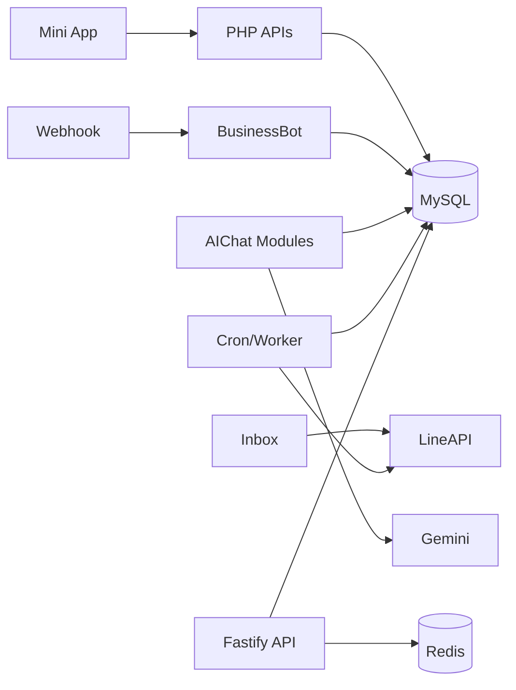

# Module Map

## Business Capability Groups

## LINE Messaging and Bot

Confirmed modules: `webhook.php`, `classes/LineAPI.php`, `classes/LineAccountManager.php`, `classes/BusinessBot.php`, `classes/FlexTemplates.php`, `assets/flex/*`.

Responsibilities: webhook signature validation, account lookup, reply/push messaging, Flex templates, shop/menu/postback flows, loyalty commands, and message persistence.

Coupling risk: `webhook.php` is very large and directly orchestrates database, LINE, AI, scheduled broadcast triggering, and bot behavior.

## CRM Inbox and Dispense

Confirmed modules: `inbox-v2.php`, `api/inbox-v2.php`, `classes/InboxService.php`, `classes/FlexTemplates.php`.

Responsibilities: conversation list, message pagination/search, assignment, tags, notes, customer medical fields, uploads, dispense records, stock decrement, cart/order creation, medicine-label Flex.

Coupling risk: `inbox-v2.php` combines page rendering, AJAX controller, SQL, upload handling, and LINE sends.

## Mini App Commerce and Member Experience

Confirmed modules: `line-mini-app/src/app/*`, `line-mini-app/src/lib/shop-api.ts`, `api/checkout.php`, `api/member.php`, `api/rewards.php`, `api/points-history.php`, `api/points-claim.php`, `api/wishlist.php`, `api/user-addresses.php`.

Responsibilities: product catalog, cart, checkout, order history/detail, slip upload, member card, points, rewards, wishlist, addresses.

Dependency: mini app depends on PHP APIs and `line_account_id` runtime resolution in `line-mini-app/src/lib/config.ts`.

## AI Telepharmacy

Confirmed modules: `api/ai-chat.php`, `api/ai-chat-history.php`, `modules/AIChat/Adapters/*`, `modules/AIChat/Services/*`, `modules/AIChat/Models/*`, `api/mims-pharmacist.php`, `api/ai-chat-vision.php`.

Responsibilities: SSE chat stream, AI settings, conversation history/state, red flag detection, symptom triage, product recommendation, RAG, MIMS knowledge, pharmacist notification.

Coupling risk: AI writes/read paths span PHP APIs, modules, `business_items`, user health tables, pharmacist notification tables, and external Gemini.

## Appointments, Video, Reminders

Confirmed modules: `api/appointments.php`, `api/video-call.php`, `api/medication-reminders.php`, `cron/appointment_reminder.php`, `cron/medication_reminder.php`, `cron/medication_refill_reminder.php`.

Responsibilities: pharmacist availability, booking, appointment status, call room URLs, medication reminders and refill tracking.

## Broadcasts and Reports

Confirmed modules: `broadcast.php`, `api/process_scheduled_broadcasts.php`, `cron/send_scheduled.php`, `cron/process_broadcast_queue.php`, `cron/broadcast_delivery_reconcile.php`, `cron/scheduled_reports.php`.

Responsibilities: scheduled messages, queue fan-out, delivery reconciliation, report generation and LINE push delivery.

## Platform and Tenant Management

Confirmed modules: `admin/platform-login.php`, `admin/switch-tenant.php`, `classes/TenantContext.php`, `modules/Core/Database.php`, `database/migration_2026-05-25_platform_master.sql`.

Responsibilities: platform login, tenant context, platform database, tenant database routing.

## Dependencies Between Modules

## Ownership and Coupling Risks

- Large procedural files (`webhook.php`, `inbox-v2.php`, `api/checkout.php`) own multiple capabilities and are high risk for regression.
- Tenant routing is split between legacy and tenant-aware database classes.
- Several PHP APIs use action switches rather than route-specific controllers, increasing contract discovery cost.
- Some jobs auto-create/alter tables at runtime (`cron/medication_reminder.php`, `cron/medication_refill_reminder.php`, `cron/restock_notification.php`, `inbox-v2.php`), which couples operational execution to schema changes.

## Last Verified From Code

Verified on 2026-07-03 from `webhook.php`, `inbox-v2.php`, `api/checkout.php`, `api/member.php`, `api/rewards.php`, `api/appointments.php`, `api/medication-reminders.php`, `classes/BusinessBot.php`, `classes/InboxService.php`, `modules/AIChat/*`, `line-mini-app/src/lib/*.ts`, `cron/*.php`, `database/migration_2026-05-25_platform_master.sql`.
