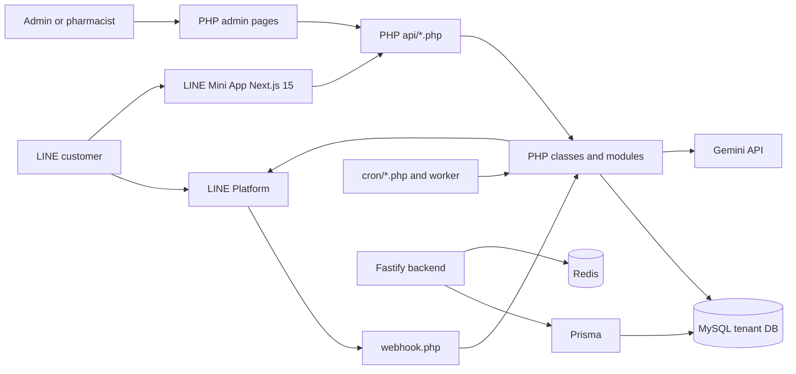

# System Context

## Confirmed Users

- Customer LINE users interact through LINE OA chat and LINE Mini App. Evidence: `webhook.php` reads `events[].source.userId`; `line-mini-app/src/lib/config.ts` resolves LIFF and line account; `api/member.php`, `api/checkout.php`, and `api/ai-chat.php` accept `line_user_id`.
- Tenant staff/admins use PHP admin pages after session login. Evidence: `includes/auth_check.php` requires `$_SESSION['admin_user']`; `auth/login.php` submits username/password; `inbox-v2.php` includes admin inbox behavior.
- Platform users use a separate platform login and platform tenant context. Evidence: `admin/platform-login.php` authenticates `platform_users`; `database/migration_2026-05-25_platform_master.sql` defines `platform_users` and `tenants`.
- Pharmacists receive/handle consultations, appointments, and triage notifications. Evidence: `database/schema_complete.sql` tables `pharmacists`, `pharmacist_consultations`, `pharmacist_notifications`; `modules/AIChat/Services/PharmacistNotifier.php`.

## External Systems

- LINE Messaging API and LIFF: `classes/LineAPI.php`, `webhook.php`, `line-mini-app/package.json` dependency `@line/liff`.
- Gemini AI: `config/config.php` key `GEMINI_API_KEY`, `modules/AIChat/Services/GeminiAPI.php`, `modules/AIChat/Adapters/*`.
- MySQL/MariaDB: `config/config.php` DB constants; `Modules\Core\Database` PDO DSN and `SET time_zone = '+07:00'`.
- Redis: `config/config.php` Redis constants; `backend/src/plugins/index.ts`; `backend/src/websocket/server.ts`.
- Email/Slack/LINE notifications in modern backend: `backend/src/services/NotificationService.ts`.
- Google OAuth/SSO for platform flow: `auth/google-callback.php`, `auth/sso-consume.php`, `config/google_oauth.example.php`.

Odoo is intentionally excluded from this document set.

## System Boundaries

Inside boundary: PHP monolith, tenant database schema, LINE Mini App, Fastify backend APIs, background jobs, worker scripts, local tests, and source docs.

Outside boundary: LINE platform, Google OAuth, Gemini API, Redis service, SMTP/Slack notification endpoints, production hosting, and Odoo.

## Major Inputs and Outputs

- Inputs: LINE webhook JSON plus `X-Line-Signature` in `webhook.php`; mini app HTTP JSON/form/multipart requests in `api/checkout.php`; admin form/AJAX posts in `inbox-v2.php`; cron execution from `cron/*.php`; Fastify JWT API calls under `backend/src/routes`.
- Outputs: LINE reply/push messages via `LineAPI::replyMessage()` and `LineAPI::pushMessage()`; JSON API responses; SSE AI chat events from `api/ai-chat.php`; database writes to messages, users, cart, transactions, points, appointments, logs, and notification tables.

## Mermaid Context Diagram

## Unknowns

The exact production DNS, active tenant list, real cron schedule, and deployed environment values were not verified from runtime.

## Last Verified From Code

Verified on 2026-07-03 from `webhook.php`, `line-mini-app/src/lib/config.ts`, `line-mini-app/package.json`, `api/checkout.php`, `api/member.php`, `api/ai-chat.php`, `includes/auth_check.php`, `admin/platform-login.php`, `database/schema_complete.sql`, `database/migration_2026-05-25_platform_master.sql`, `backend/src/services/NotificationService.ts`.
