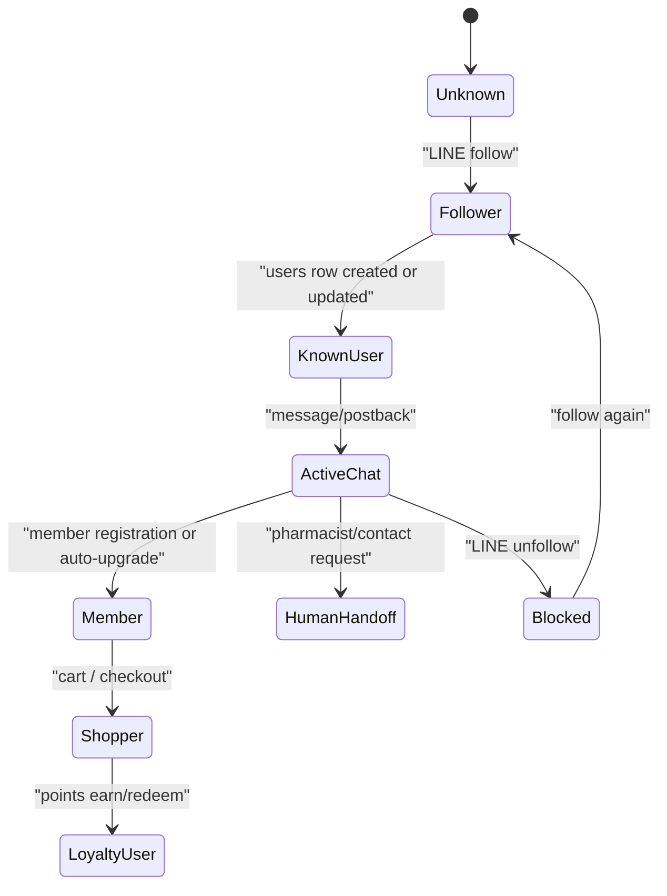

# User Lifecycle

## Scope

This document describes how a customer moves through the system from LINE follow to member registration, messaging, commerce, loyalty, and unfollow/block state.

## Lifecycle Overview

## Confirmed Stages

### 1. Unknown LINE User

Before the first webhook or LIFF API call, the system knows only the LINE user ID provided by LINE runtime context.

Evidence:

- `api/checkout.php` and `api/user-profile.php` require `line_user_id` for many LIFF actions.
- `webhook.php::getOrCreateUser()` creates or updates a `users` row when a LINE event is processed.

### 2. Follower

Confirmed behavior:

- `webhook.php::handleFollow()` calls the LINE profile API and stores display name, picture URL, and status message.
- `webhook.php::handleFollow()` inserts or resolves a row in `users`.
- `webhook.php::saveAccountFollower()` stores per-account follower state in `line_account_followers`.
- Follow handling can trigger CRM, auto-tag, rich-menu, Telegram notification, and welcome-message paths.

### 3. Active Chat User

Confirmed behavior:

- `webhook.php::handleMessage()` stores inbound message data in `messages`.
- `webhook.php` stores `reply_token` and `reply_token_expires` on `users`.
- `webhook.php::updateAccountDailyStats()` increments per-account stats such as total messages.
- `classes/BusinessBot.php` routes commands for menu, points, rewards, member card, order, and stateful interactions.
- `user_states` is used for temporary conversational state and includes `expires_at` in both `webhook.php` helper paths and `classes/BusinessBot.php`.

### 4. Registered Member

Confirmed behavior:

- `api/member.php?action=register` updates or inserts `users` with membership fields such as `member_id`, `is_registered`, and `registered_at`.
- `api/member.php` can auto-register a new member from LINE login.
- `api/member.php` can auto-upgrade an existing non-member user to member status.
- `webhook.php::ensureMemberRegistered()` can promote a user to registered-member status without awarding welcome-bonus points.
- `api/member.php` logs welcome-bonus points into `points_history` when the points columns/tables exist.

### 5. Shopper

Confirmed behavior:

- `api/checkout.php` resolves or creates a user from `line_user_id`.
- `api/checkout.php` writes cart rows with `user_id`, `line_user_id`, product IDs, and quantity.
- `api/checkout.php` creates transaction/order records with `line_account_id`, `user_id`, `line_user_id`, amount, payment method, and delivery information.
- `api/checkout.php` sends LINE receipt/confirmation messages when channel credentials and `line_user_id` are available.

### 6. Loyalty User

Confirmed behavior:

- `api/member.php` and `classes/BusinessBot.php` expose member card, points, rewards, and redemption flows.
- Points tables include `points_history`, `loyalty_points`, `loyalty_points_history`, `points_settings`, and reward-related tables in `database/install_complete_latest.sql`.
- `points_settings.points_expiry_days` defaults to 365 and supports `0 = no expiry`.
- Receipt-points flow in `webhook.php` can scan receipt images, calculate points, add points, and persist a receipt-points Flex card.

### 7. Blocked/Unfollowed User

Confirmed behavior:

- `webhook.php::handleUnfollow()` sets `users.is_blocked = 1`.
- The code keeps the user row rather than deleting it on unfollow.
- Follower state is also tracked separately in `line_account_followers`.

## Key Data Objects

| Object | Purpose | Evidence |
| --- | --- | --- |
| `users` | Core LINE/customer/member record | `webhook.php`, `api/member.php`, `api/user-profile.php`, `database/install_complete_latest.sql` |
| `line_account_followers` | Per-LINE-account follower state | `webhook.php::saveAccountFollower()` |
| `messages` | Conversation history | `webhook.php::handleMessage()`, `database/install_complete_latest.sql` |
| `user_states` | Temporary conversational state | `webhook.php`, `classes/BusinessBot.php` |
| `points_history` | Loyalty point events | `api/member.php`, `database/install_complete_latest.sql` |
| `transactions` / order tables | Checkout and purchase state | `api/checkout.php`, `database/install_complete_latest.sql` |

## Boundary Risks

- Many APIs accept `line_user_id`; tenant-scoped reads must also apply `line_account_id` when available to avoid cross-account leakage.
- `api/member.php` contains fallback logic that may query by `line_user_id` without account scope when account-specific lookup fails; this is useful for legacy compatibility but increases coupling risk.
- Unfollow does not delete user data. This is operationally useful for re-follow recovery but relevant for privacy/data-retention policy.
- Temporary state has `expires_at`, but cleanup coverage for all state rows was not confirmed.

## Unknowns

- A full consent-gated lifecycle policy was not confirmed, though `webhook.php` references privacy/terms consent fields and `user_consents`.
- A code-backed account-deletion or anonymization workflow for end users was not confirmed.
- Exact business definition of "active member" is not centralized in one file.

## Last Verified From Code

- Verified from `webhook.php`, `classes/BusinessBot.php`, `api/member.php`, `api/user-profile.php`, `api/checkout.php`, and `database/install_complete_latest.sql` on 2026-07-03.

